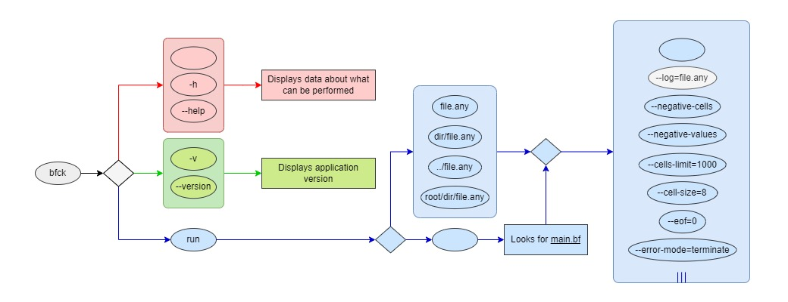
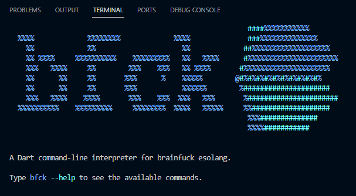

This is **bfck**, a CLI interpreter for [brainf**ck esolang](https://esolangs.org/wiki/Brainfuck) written in Dart.

## Motivation

This application was developed as an experiment to practice my abilities and to have fun during the process.

The developer tried to implement the behavior described in [this documentation](https://esolangs.org/wiki/Brainfuck#Language_overview). The application includes a few options and flags that allow the user do interfere with the default interpreter behavior.

#

Here is a simplified tree that represents the pathways you can take with the commands, options, flags and arguments that can be passed to the application. 



## Activation
You can activate the application using Dart SDK:
> You must have Dart SDK configured in your machine ([see how](https://dart.dev/get-dart)).
- **Option 1:** 
    - You can activate the application directly via the following command:
    ```console
    user@pc:~/Repos$ dart pub global activate --source git https://github.com/gus-caribe/bfck
    ```
- **Option 2:**
    > You must have GIT installed ([see how](https://git-scm.com/book/en/v2/Getting-Started-Installing-Git)).
    - You can clone this repository:
    ```console
    user@pc:~/Repos$ git clone https://github.com/gus-caribe/bfck
    ```
    - Then go into the cloned repository directory:
    ```console
    user@pc:~/Repos$ cd bfck
    ```
    - And then activate it using the following command:
    ```console
    user@pc:~/Repos/bfck$ dart pub global activate --source path .
    ```

After that, you're all set! You can execute **bfck** command from any directory and explore the options adding the **--help** flag.



## Contribute
- You can open any issues to offer suggestions, report bugs and much more. All you have to do is open an issue.
- I am currently struggling to find a way to implement a /b/compile/b/ option to generate native executables for brainf**k files. I've already checked dart_eval, but I'd like to compile to machine code, not Dart binaries. If you have any suggestions, you are more than welcome to leave it in a new issue.

## Versioning
- Cosmetic improvement: **X.X.X+^**
> **Ex.:** [3.1.4 -> 3.1.4+1], [3.1.4+1 -> 3.1.4+2].
- Bug fixed / adaptation made: **X.X.^--**
> Ex.: [3.1.4+2 -> 3.1.5].
- Feature added: **X.^.0--**
> Ex.: [3.1.5 -> 3.2.5].
- Unit tests covered: **X.0.0--**
> Ex.: [3.2.5 -> 4.0.0].

## Donate
- **PayPal**
[](https://www.paypal.com/donate/?hosted_button_id=CXX5CKLZHNK3C)
- **Buy me a coffee**
[](https://www.buymeacoffee.com/guscaribe)

## License
[MIT](https://choosealicense.com/licenses/mit/)

